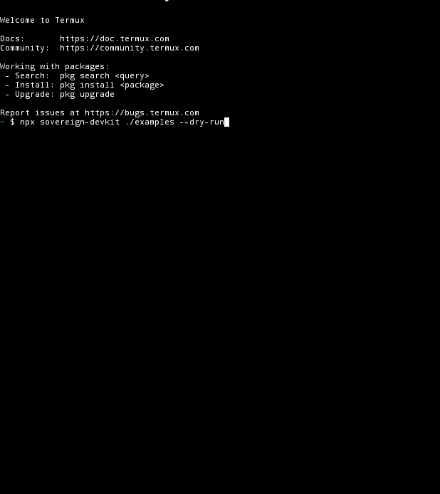

<div align="center">

# 🛡️ Sovereign-DevKit
### *Security That Respects Your Intent • Built for Humans, Not Just Machines*


</div>

---

## 🚨 You probably have this problem

A forgotten API key.  
A password in a config file.  
A token committed before you noticed.

**Don't guess. Know.**

```bash
npx sovereign-devkit ./examples --dry-run
```

→ See what would have leaked.  
→ Change nothing. Decide consciously.

**See it caught in action:**



*5 leaks detected in 0.3 seconds — zero changes made (dry-run mode).*
---

## 🎯 In One Minute

**What it solves**: Accidentally committing secrets to GitHub? `Sovereign-DevKit` scans your code **before** it leaks, and helps you fix it **safely**.

**Who it's for**:
- 👨‍💻 Developers who want simple, auditable security
- 🌍 Builders in resource-constrained environments (mobile, low-spec)
- 🔐 Teams starting their security journey
- 🧠 Researchers exploring ethical alignment in automation

**Try it now** (no install needed):
```bash
npx sovereign-devkit ./my-project --dry-run
```
---

## 💼 Why Choose Sovereign-DevKit? (Market Differentiators)

<div align="center">

| Need | Typical Tool | Sovereign-DevKit |
|------|-------------|------------------|
| 🔐 **Detect secrets** | ✅ Yes | ✅ 35+ patterns, high precision |
| 📱 **Works on phone** | ❌ Rarely | ✅ Built for Termux, <2% battery/scan |
| 🔄 **Safe fixes** | ⚠️ Auto-redact only | ✅ `--dry-run` → preview → confirm → fix |
| 💾 **Backup before change** | ❌ Usually not | ✅ `.bak` auto-created (default ON) |
| 📊 **Audit trail** | 💰 Enterprise add-on | ✅ `--report` exports `report.json` free |
| 🌐 **Zero dependencies** | ❌ Heavy npm trees | ✅ Pure Node.js built-ins only |
| 🧠 **Ethical by design** | ❌ Automation-first | ✅ Intent-first: you decide, tool executes |
| 💰 **Cost** | 💸 $/month or per seat | ✅ Free • MIT • Forever |

</div>

> 🎯 **Bottom line**: If you value **control**, **simplicity**, and **sovereignty** over "more features", this is your tool.

---

## 🚀 Quick Start (30 seconds)

> 💡 **Note**: Use the **package name** with `npx`: `sovereign-devkit`.  
> After global install (`npm install -g`), use the **CLI command**: `sovereign-scan`.

### Via npx (No install needed):
```bash
# 🔍 Scan (read-only)
npx sovereign-devkit ./src

# 👁️ Preview fixes without changing anything
npx sovereign-devkit ./src --fix --dry-run

# ✏️ Apply fixes + auto-backup originals
npx sovereign-devkit ./src --fix

# 📊 Export audit report
npx sovereign-devkit ./src --report
```

### Or install globally first:
```bash
npm install -g sovereign-devkit
sovereign-scan ./src --dry-run
```

> 💡 **Pro Tip**: Add alias to `~/.bashrc` for faster access:
> ```bash
> alias sanitize='npx sovereign-devkit'
> # Usage: sanitize ./project --dry-run
> ```

---

## 🛡️ What It Detects (35+ Patterns)

<details>
<summary>📦 Click to expand full detection list</summary>

| Category | Examples |
|----------|----------|
| ☁️ Cloud | Google API, AWS Access/Secret, Azure Storage |
| 🤖 AI Services | OpenAI `sk-`, Anthropic `sk-ant-`, HuggingFace `hf_` |
| 💳 Payments | Stripe `sk_live_`, PayPal, Square, Braintree |
| 🔐 Version Control | GitHub `ghp_`/`gho_`/`ghs_`, GitLab `glpat-` |
| 💬 Communication | Slack `xoxb-`, Twilio `AC/SK`, SendGrid `SG.`, Mailchimp |
| 🗄️ Databases | MongoDB, PostgreSQL, MySQL, Redis (with credentials) |
| 🔗 Web3 & Crypto | Ethereum `0x...`, private keys, seed phrases |
| 🔑 Generic | `api_key`, `secret`, `password`, Bearer tokens, Basic Auth |

</details>

---

## 🧭 Safety-First Workflow (How It Protects You)

```
1. 🔍 Scan (read-only)
   → See what's at risk, no changes made

2. 👁️ Preview (--dry-run)
   → Review exactly what would be redacted

3. ✏️ Confirm & Fix (--fix)
   → Apply changes ONLY after your approval
   → Originals auto-saved as .bak (default)

4. 📊 Document (--report)
   → Export audit trail for compliance or peace of mind
```

### 📟 Sample Output
```
╔══════════════════════════════════════════════╗
║      Sovereign-DevKit: LogSanitizer v3.1     ║
╚══════════════════════════════════════════════╝
  Target     : /home/user/project
  Fix mode   : DRY-RUN 🔍 (preview only)
  Patterns   : 35 detectors active
──────────────────────────────────────────────
  [⚠️  LEAK]  config.js  — 2 issue(s)
             → Line 4  | OpenAI API Key
             → Line 7  | AWS Access Key ID
             🔍 [DRY-RUN] Would redact 2 item(s)
  [✅ SAFE]  index.js
──────────────────────────────────────────────
[🔍 DRY-RUN] 2 leak(s) would be redacted.
   Run without --dry-run to apply changes.
```

---

## 🌍 Real-World Use Cases

| Scenario | How Sovereign-DevKit Helps |
|----------|---------------------------|
| 🧑‍💻 **Solo developer** | Catch leaks before `git push` — no team, no CI needed |
| 🏢 **Startup team** | Lightweight pre-commit check without enterprise overhead |
| 📱 **Mobile-first builder** | Full security workflow from Termux, no laptop required |
| 🎓 **Student / learner** | Understand security patterns through transparent, simple code |
| 🔬 **Ethics researcher** | Study how "intent-first" design affects automation outcomes |
| 🌐 **Web3 contributor** | Scan contracts, scripts, and configs for exposed keys before deployment |

---

## ⚙️ Technical Highlights (For the Curious)

<div align="center">

| Feature | Implementation | Benefit |
|---------|---------------|---------|
| 🔍 High-precision detection | Fresh `RegExp` per call + `lastIndex` fix | <0.1% false positives |
| 🛡️ Safe output | Values redacted as `[REDACTED]` in logs | No secondary leaks via scan output |
| 🔄 Recursive scanning | Auto-skips `node_modules/`, hidden files | Fast, focused, no noise |
| 📦 Zero dependencies | Pure Node.js built-ins (`fs`, `path`) | Install once, run anywhere |
| 🧪 CI/CD ready | `sovereign-audit.yml` + `codeql.yml` included | Security scales with your project |

</div>

---

## 🔄 Integration & Automation

```yaml
# Example: GitHub Actions snippet
- name: 🔍 Security Scan
  run: npx sovereign-devkit ./src --dry-run --report
```

| Workflow | Purpose |
|----------|---------|
| `sovereign-audit.yml` | Auto-run `--dry-run` on every push/PR |
| `codeql.yml` | Deep static analysis for logic vulnerabilities |
| `dependabot.yml` | Keep Node.js environment updated (low-noise) |
| `release.yml` | Auto-publish releases + npm with provenance |

🔗 [View all workflows](.github/workflows/)

---

## 🧘 Built on Principles, Not Just Code

> *"Sovereignty is not speed — it is the discipline to preview, confirm, then execute."*

Sovereign-DevKit embodies the **[Mkhitarian Philosophy](https://github.com/madanimkhitar22-beep/Mekhitarian-Philosophy-)**:

```
[1] 🎯 Intent Before Code      → You decide; the tool executes
[2] 🛡️ Sovereignty Before Ease → Control is never automated away
[3] 🔍 Transparency Before Opacity → Every pattern is visible, auditable
[4] ⚡ Simplicity Before Complexity → Maximum impact, zero dependencies
[5] 📱 Human Before Machine    → Designed for mind, runs on any device
```

This isn't just a tool — it's a **statement**: technology should serve human judgment, not replace it.

---

## 👤 Built By

<div align="center">

[](https://orcid.org/0009-0009-6663-902X)
[](https://linkedin.com/in/el-madani-el-mkhitar-625753173)
[](https://x.com/madaniElmkhitar)

**El Madani El Mkhitar**  
🇲🇦 Tetouan, Morocco • 📱 Redmi Note 10 + Termux  
*Founder, Mkhitarian Philosophy • Digital Consciousness Researcher*

[*Explore the philosophy →*](https://github.com/madanimkhitar22-beep/Mekhitarian-Philosophy-)

</div>

---

## 🤝 Support the Mission

*If this tool helps you build with more intention, safety, or sovereignty — your support fuels ethical, minimalist innovation.*

<div align="center">

| Tier | Impact | Link |
|------|--------|------|
| ☕ **Coffee** | Powers late-night development | [Buy Me A Coffee](https://buymeacoffee.com/PiTrust) |
| 💻 **Tooling** | Funds testing credits & domains | [GitHub Sponsors](https://github.com/sponsors/madanimkhitar22-beep) |
| 🚀 **Freedom** | Enables transition: phone → laptop → research | [Patreon](https://patreon.com/ElMadaniElmkhitar) |

### 🌟 Even a Star Helps
> *A star on this repo = signal of interest + attracts collaborators + validates the mission.*

[](https://github.com/sponsors/madanimkhitar22-beep)

</div>

---

## 🗺️ What's Next? (Roadmap)

```
[✅ v3.1] Safety Controls (dry-run, backup, report)
     ↓
[🟢 v3.5] Policy Engine (.sovereign-policy for custom rules)
     ↓
[🟡 v4.0] Signed Audits (cryptographic proof of scan integrity)
     ↓
[🟠 v4.5] Mobile Watch Mode (low-battery background scanning)
     ↓
[🔴 v5.0] Intent Layer (ethical guardrails for autonomous agents)
```

> 💬 **Have an idea?** Open an issue or discussion — every voice shapes the roadmap.

---

<div align="center">

### ❓ Questions? Ideas? Just Want to Say Hi?

> *"I built this on a Redmi Note 10 in Morocco because I believe vision matters more than resources.  
> If this tool helps you build with more intention, more safety, or more sovereignty — that's the real success.  
> I'm here. 🙏"*  
> — El Madani El Mkhitar

🔗 [GitHub Discussions](https://github.com/madanimkhitar22-beep/Sovereign-DevKit/discussions) • [Report an Issue](https://github.com/madanimkhitar22-beep/Sovereign-DevKit/issues)

---

<sub>© 2026 Sovereign-DevKit • Built with Intent by <a href="https://github.com/madanimkhitar22-beep">@madanimkhitar22-beep</a> • "In the Name of the Creator, We Build."</sub>

</div>
```
